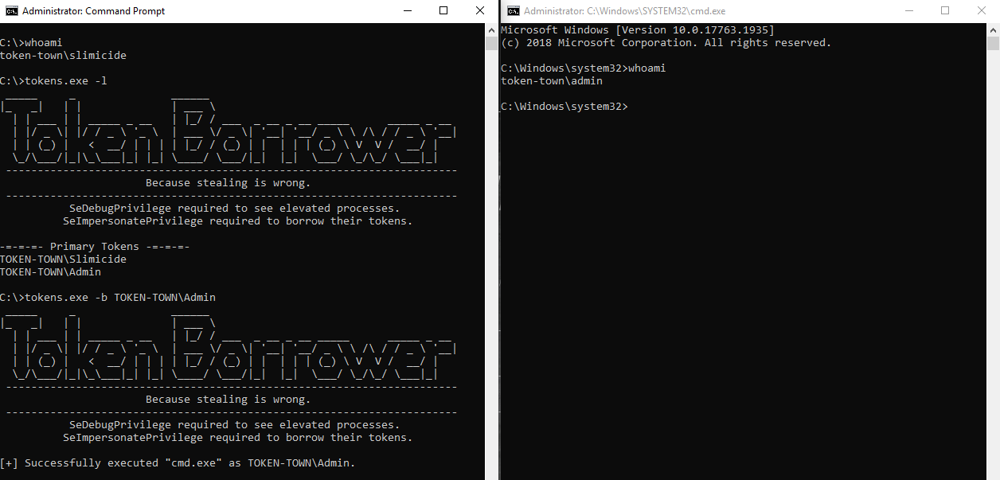

# TokenBorrower
Windows access token parser and borrower.

Inspired by Incognito.

Created for experimentation with Windows access tokens, privileges and general internals.

Requires SeImpersonatePrivilege to borrow tokens.\
Requires SeDebugPrivilege to discover elevated and otherwise interesting processes to borrow from.



```
Usage:

-h               Display usage message.
-l               List tokens discoverable by current user.
-b Domain\Name   Borrow Domain\Name's access token for execution (DEFAULT: cmd.exe).
-e Command       Execute "Command" as Domain\Name.
-v               Enable (very) verbose output.
```
